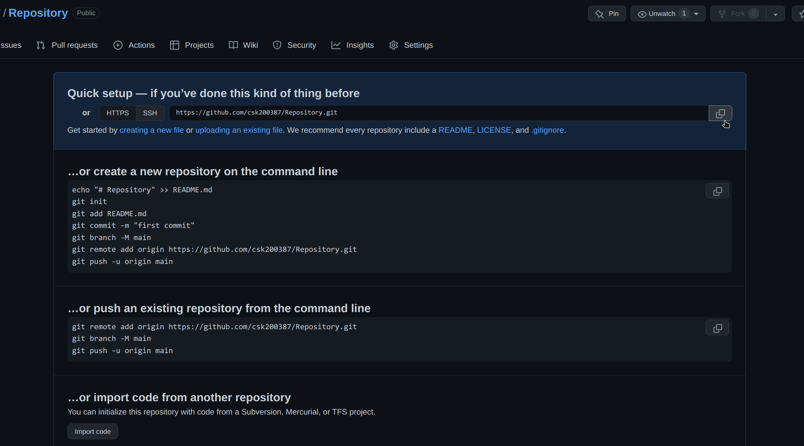
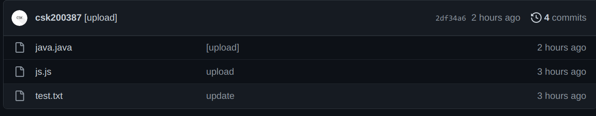
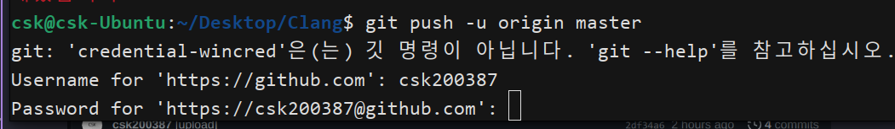

# 02 - 깃(Git) 시작하기
Git과 GitHub를 사용하기 위한 가장 간단하고 기초적인 내용
* [git 설치 & 계정정보 저장](#1-git-계정정보-저장하는-방법)
* [깃허브의 프로젝트 파일을 로컬 저장소로 복사하는 방법](#2-깃허브의-프로젝트-파일을-로컬-저장소로-복사하는-방법)
* [로컬 저장소의 파일을 깃허브로 업로드 하는 방법](#3-로컬-저장소의-파일을-깃허브로-업로드-하는-방법)
    * 로컬에서 작업하는 내용을 깃허브에 업로드하여 커밋 기록을 남기며 작업하고 싶을 때
<hr>

## 1. git 계정정보 저장하는 방법
```bash
git config --global user.name "{UserID}"
git config --global user.email "{UserEmail}"
```
`--global` : 전역 옵션. 프로젝트별로 다른 계정을 사용하려면 해당 옵션을 제거하면 된다.  
<br>
commit시 계정 정보를 일일이 입력할 필요가 없어진다.
<hr>

## 2. 깃허브의 프로젝트 파일을 로컬 저장소로 복사하는 방법
```bash
git clone {RepoURL} {Dir}
```
`RepoURL` : 로컬 저장소로 복사할 깃허브의 리포지토리 링크.


`Code` 의 HTTPS 탭에서 리포지토리의 주소를 복사할 수 있다.
<hr>

## 3. 로컬 저장소의 파일을 깃허브로 업로드 하는 방법
<br>

### 1. git 저장소 초기화
```bash
git init
```
해당 명령어는 Git 저장소를 초기화하여 새로운 Git 저장소를 생성하거나 기존의 디렉토리를 Git 저장소로 변환할 수 있도록 필요한 파일과 디렉토리를 생성하는 명령어이다. <br>
해당 명령어 입력시 현재 디렉토리에 `.git` 폴더가 생성될 것이다.
<br><br>

### 2. git 저장소로 파일 추가
```bash
git add .
```
`.` : 현재 디렉토리의 모든 파일 & 폴더
<br><br>

### 3. GitHub 리포지토리 생성후 연결


or


`New` 버튼을 클릭한다.
<br>


`Repository name` : 리포지토리의 타이틀  
`Description` : 리포지토리의 설명  

`Public` / `Private` : `Public` 을 선택할 시 다른사람이 볼 수 있다.

`Add a README file` : 리포지토리 페이지의 제목과 설명을 보여주는 Markdown 파일을 생성한다. **아래에 나올 명령어로 업로드를 진행할 때 브랜치가 꼬일 수 있으므로 생성하지 않는 것을 추천함.**  
<br>



정상적으로 생성되었다면 위처럼 화면이 나올텐데, 상단의 링크를 복사하여 아래의 명령어에 입력한다.

```bash
git remote add origin {GitURL}
```
`GitURL` : Git 주소

### 4. 커밋기록 작성
```bash
git commit -m "{Message}"
```
`-m` : 커밋 메시지를 입력하는 옵션  
`Message` : 파일명 우측에 표시될 메시지이다.  
*Ex)*  

<br>

### 5. 원격 저장소로 푸시
```bash
git push -u origin master
```
해당 명령어를 입력하면 아래와 같이 `Username` 과 `Password` 를 입력하라고 뜰 것이다. `Username` 은 GitHub의 ID를 입력하면 되고 `Password` 는 `Personal access tokens` 을 발급받아 입력해야 한다.


[Personal access tokens 발급받는 방법](github-04.md)
<hr>

### IDE 를 사용하는 경우
VSCODE를 사용하는 경우, Push시 인증정보를 입력하지 않아도 된다. 