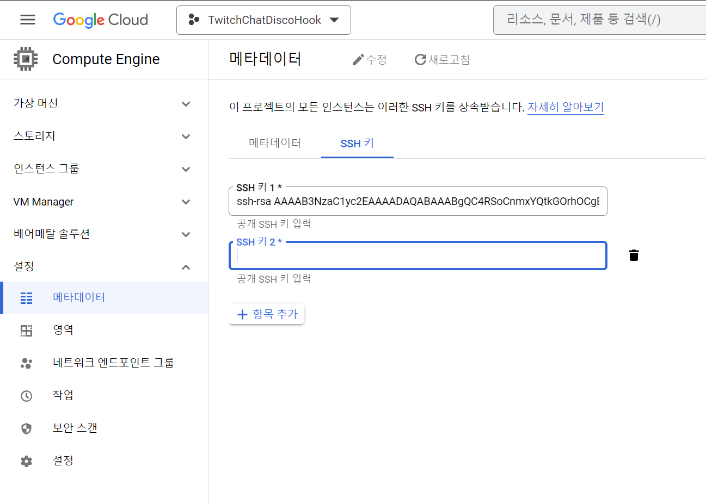

# 01 - GCP SSH 연결
로컬 터미널에서 GCP VM인스턴스 터미널 접속하기
<hr>

## SSH 키 생성
```bash
ssh-keygen -t rsa -f ~/.ssh/{KeyName} -C {Username}
```

`KeyName` : 생성될 Key의 파일명  
`Username` : VM 인스턴스에서 사용할 사용자명

명령어 입력시 질문이 뜰텐데 엔터로 넘어가면 된다.

SSH 키를 생성했다면, `~/.ssh` 경로에 파일이 2개 생성되었을 것이다.

`KeyName` : 개인키  
`KeyName.pub` : 공개키
<hr>

## SSH 키 등록
설정 → 메타데이터 → SSH키 → 수정
<br>
`KeyName.pub` 의 내용을 입력한다.
<br>



<hr>

## SSH 접속

```bash
ssh -i ~/.ssh/{PrivateKey} {Username}@{IP}
```

`PrivateKey` : 개인키 파일명  
`Username` : 키 생성할 때 입력한 사용자명  
`IP` : GCP VM 인스턴스의 외부IP

<hr>

## 기타
`alias` 로 단축 명령어를 생성하여 사용할 수 있다.

```bash
alias sshconnect='ssh -i ~/.ssh/{PrivateKey} {Username}@{IP}'
```
[alias 란?](linux-04.md)