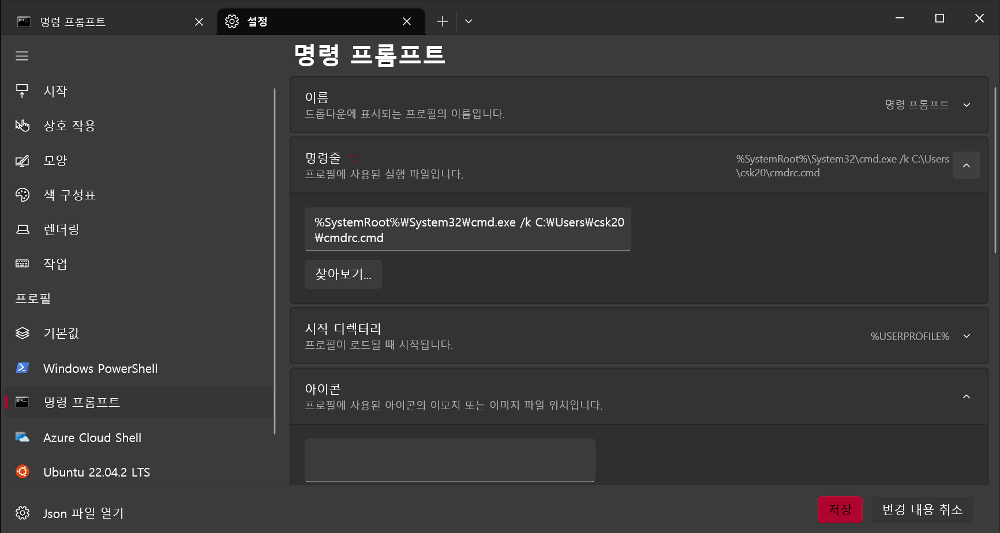

# Alias 단축명령어 사용하기
리눅스의 `alias` 를 사용하여 많이 사용하는 명령어를 단축어로 지정 가능

## 1. alias
```bash
alias {alias_name}='{command}'
```

위와 같이 입력하면 `{alias_name}` 을 입력하면 `{command}` 가 
실행된다.

## 2. bashrc
```bash
vim ~/.bashrc
```

bashrc는 bash가 실행될 때마다 실행되는 파일이라고 보면 될 것 같다.
파일 가장 아래에 alias를 추가하면 터미널을 실행할 때마다 alias가 적용된다.

```bash
alias {alias_name}='{command}'
```

## 윈도우에서도 사용하기

CMD에선 `doskey`를 `alias`대신 사용할 수 있다.

```bash
doskey {alias_name}='{command}'
```

CMD에선 bashrc가 없기 때문에 다른 방법으로 명령어를 등록해야 한다.

### .cmd 파일 만들기

```bash
doskey {alias_name}='{command}'
```

위와 같이 작성한 뒤 `.cmd` 확장자로 저장한다. 파일명은 아무거나 상관없다.

### 실행 옵션 추가하기

```bash
%SystemRoot%\System32\cmd.exe /k C:\Users\csk20\cmdrc.cmd
```
원래 있던 옵션 뒤에 `/k C:\Users\csk20\cmdrc.cmd` 를 추가한다.  
`cmd.exe` 가 실행할 때 `.cmd`파일을 실행하도록 옵션을 추가한다.  
`/k` : 문자열로 지정된 명령을 수행하고 계속함.  


위는 Windows Terminal에서 설정한 모습이다.